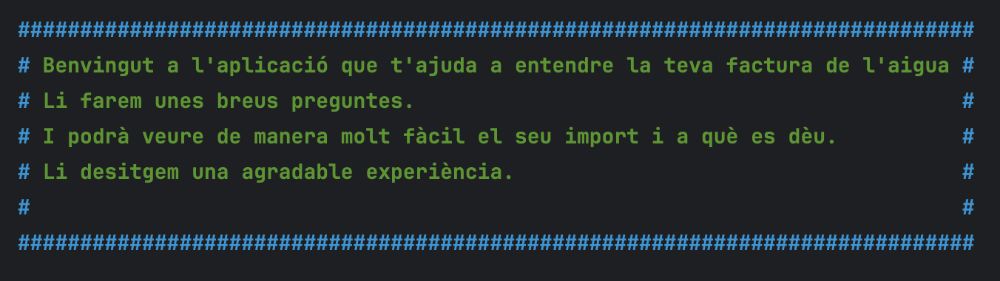
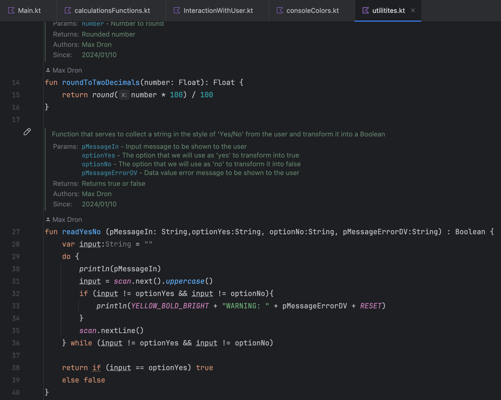
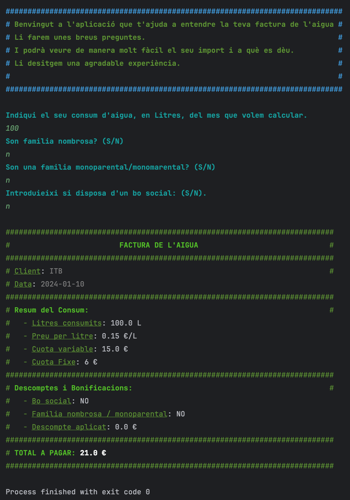
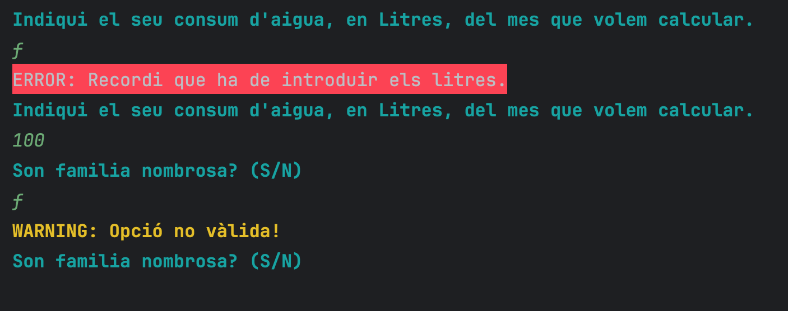
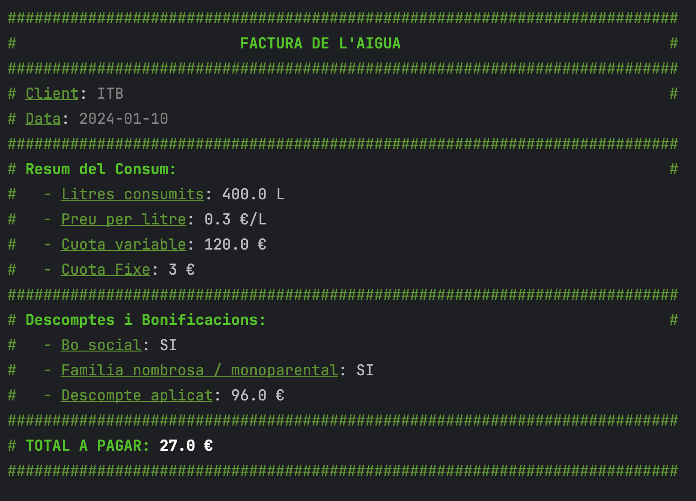

# PROJECT: LiquidAccount 💧


# 🎥 Overview
Welcome to LiquidAccount!
I am pleased to introduce my new educational project, a program that calculates and explains your electricity bill (simplified version). It is an activity focused on modular programming, use of third-party libraries, unit testing, KDoc documentation, and acquiring good practices, both locally and here, in the remote realm of GitHub and its ecosystem.

<a id = "toc"></a>
# 📲 Table of contents
1. [Project Description](#project-description)
2. [How to Install and Run the Project](#install)
3. [Project Execution](#execution)
4. [Summary](#summary)

<a id = "project-description"></a>
# 💻 Project Description
LiquidAccount welcomes you as your assistant designed to demystify and explain water bills. This platform will guide you through every aspect of your bill, using precise calculation tools. As you navigate its code, you'll discover the importance of clear and effective documentation. So, this project will not only improve your understanding of water bills but will also provide you with valuable and applicable skills in the real world of programming and software development.



The application relies on a file of functions to display various interaction [menus](/src/main/kotlin/InteractionWithUser.kt) with the user, a file for all functions related to [calculation](/src/main/kotlin/calculationsFunctions.kt). Additionally, two support files are included—one that provides quick and simple functions for [coloring](/src/main/kotlin/consoleColors.kt) console output, and another support file with [useful functions](/src/main/kotlin/utilitites.kt) for keyboard input, data validation, etc.

Finally, for this project, the classic test folder has been enabled, with a class full of functions that [test](/src/test/kotlin/CalculationsFunctionsKtTest.kt) most of the program's algorithms several times.


<a id = "install"></a>
# How to Install and Run the Project
Here, I'll show you how you can install and run it on your own machine.

## 🔧 Prerequisites
Before you begin, make sure you have the following installed on your machine:

- [Java Development Kit (JDK)](https://www.oracle.com/java/technologies/javase-downloads.html)
- [Kotlin](https://kotlinlang.org/docs/tutorials/command-line.html)

## ⚙️ Installation Steps

1. **Clone the Repository:**
   ```bash
   git clone https://github.com/your-username/your-project.git
   cd your-project
   ```
2. **Compile the Project:**
   ```bash
   kotlinc -include-runtime -d your-project.jar src/main/kotlin/*.kt
   ```
3. **Run the Application:**
   ```bash
   java -jar your-project.jar
   ```
> [!NOTE]
> Another option is to import the repository into your favorite IDE. For optimal import and execution, it is recommended to use IntelliJ with Gradle


<a id="execution"></a>
# 🖥 Project Execution
Run the project and follow the on-screen instructions.



> [!NOTE]
> Don't worry if you enter the data incorrectly; the application has everything planned for that.



In the end, you will obtain the result of the function based on the inputs you provided to the application.



To delve deeper into this project, you have a whole series of [tests](/src/test/kotlin/CalculationsFunctionsKtTest.kt) programmed to play with this program.


---
<a id="summary"></a>
## 🔑 Thank You for Exploring!

I look forward to your opinions on this educational project. Personally, I have enjoyed and learned a lot working on it. Gradually, the foundations are becoming firm, and a great programmer is growing.

Looking forward to our paths crossing again in future, in more intricate projects.

Happy coding!
---
[Go back to Table of contents](#toc)


